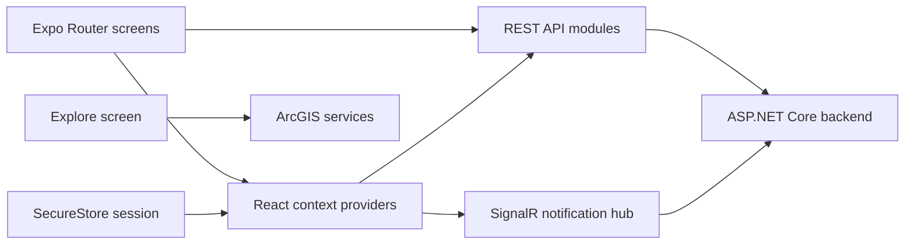

# EGYXplore Mobile App

EGYXplore is an Expo and React Native tourism application for discovering Egyptian destinations, planning trips, completing missions, earning rewards, and managing a traveler profile. The Explore screen uses native ArcGIS maps, feature layers, search, location, and routing.

> [!IMPORTANT]
> This project uses native modules, including `expo-arcgis`. It does not run in Expo Go. Build and install a development client with `npx expo run:android` or `npx expo run:ios`.

## Features

- Register, sign in, restore sessions, and manage profile information.
- Explore ArcGIS destination and branch feature layers.
- Search for places, inspect map features, use device location, and draw routes.
- Browse destinations and create, update, complete, or delete trips.
- Build a draft itinerary from selected destinations.
- Chat with the AI assistant using text, images, and recorded audio.
- Complete missions, verify mission photos, collect points, and redeem rewards.
- Receive mission and reward updates through SignalR.
- Switch themes and configure notification preferences.

## Technology

- Expo SDK 57 and React Native 0.86
- React 19 and Expo Router
- `expo-arcgis` 0.3.3
- ASP.NET Core REST API and SignalR backend
- Expo SecureStore for the local authenticated session
- React Hook Form and Zod for forms and validation

## Requirements

Install the tools required by your target platform:

- Node.js 20 or 22 and npm
- Git
- Android: JDK 17, Android Studio, Android SDK, and either an emulator or USB-debuggable device
- iOS: macOS, Xcode, Xcode Command Line Tools, and CocoaPods
- A running EGYXplore backend reachable from the device
- ArcGIS API key, Lite license key, and feature-layer service URLs

The backend used by this workspace is located at:

```text
Back-End/Essam-BackEnd/Tourism-project/Tourist_Project_MVC-main/Tourist_Project_MVC
```

## Environment Configuration

Create the local environment file from the template:

```bash
cp .env.example .env
```

Configure these variables:

| Variable | Purpose |
| --- | --- |
| `EXPO_PUBLIC_API_BASE` | Reachable backend origin, without a trailing `/api` |
| `EXPO_PUBLIC_ARCGIS_API_KEY` | ArcGIS location-services API key |
| `EXPO_PUBLIC_ARCGIS_LICENSE_KEY` | ArcGIS Runtime Lite license string |
| `EXPO_PUBLIC_ARCGIS_DESTINATIONS_URL` | Destination FeatureServer layer URL |
| `EXPO_PUBLIC_ARCGIS_BRANCHES_URL` | Branch FeatureServer layer URL |
| `EXPO_PUBLIC_ARCGIS_DESTINATIONS_PORTAL_ID` | Destination portal item ID, when required |
| `EXPO_PUBLIC_ARCGIS_ROUTE_SERVICE_URL` | ArcGIS route service URL |

Example:

```dotenv
EXPO_PUBLIC_API_BASE=https://your-public-backend.example.com
EXPO_PUBLIC_ARCGIS_API_KEY=your_api_key
EXPO_PUBLIC_ARCGIS_LICENSE_KEY=your_lite_license_key
EXPO_PUBLIC_ARCGIS_DESTINATIONS_URL=https://services.example.com/FeatureServer/0
EXPO_PUBLIC_ARCGIS_BRANCHES_URL=https://services.example.com/FeatureServer/0
EXPO_PUBLIC_ARCGIS_DESTINATIONS_PORTAL_ID=your_portal_item_id
EXPO_PUBLIC_ARCGIS_ROUTE_SERVICE_URL=https://route-api.arcgis.com/arcgis/rest/services/World/Route/NAServer/Route_World
```

`EXPO_PUBLIC_*` values are embedded in the client bundle. Do not use them for confidential server secrets. Keep `.env` uncommitted.

### Backend Address

The default API origin is `http://localhost:5217`, but `localhost` on a phone or emulator refers to that device, not the development computer. Set `EXPO_PUBLIC_API_BASE` to an address the target can reach:

- Physical device: use the computer's LAN address or an HTTPS tunnel.
- Android emulator: commonly use `http://10.0.2.2:5217`.
- iOS Simulator: `http://localhost:5217` can normally reach the Mac.

The shared API helper appends `/api`, while the SignalR client connects to `/notificationHub`. The AI endpoints currently use `EXPO_PUBLIC_API_BASE` directly, so the configured value must be the backend origin rather than an `/api` URL.

## Install

```bash
git clone https://github.com/mhmd02/EGYXplore-expo-arcgis.git
cd EGYXplore-expo-arcgis
npm install
```

## Run on Android

1. Install JDK 17 and Android Studio.
2. In Android Studio's SDK Manager, install an Android SDK platform, Build Tools, Command-line Tools, Platform Tools, and an emulator.
3. Set `ANDROID_HOME` to the Android SDK directory and add `platform-tools` to `PATH`.
4. Start an emulator or connect a phone with USB debugging enabled.
5. Build and install the app:

```bash
npx expo prebuild --platform android
npx expo run:android
```

Verify a physical device connection with:

```bash
adb devices
```

## Run on iOS

Install Xcode and CocoaPods, then build the native development app:

```bash
npx expo prebuild --platform ios
npx pod-install
npx expo run:ios
```

If CocoaPods installation or `pod install` was interrupted, rerun `npx pod-install`. It is safe to run again.

## Daily Development

After the native development app has been installed, start Metro with:

```bash
npx expo start --dev-client
```

Use a clean Metro cache after changing environment values or when the bundle appears stale:

```bash
npx expo start --dev-client --clear
```

Rebuild the native app after changing:

- Native dependencies such as `expo-arcgis`
- Expo config plugins or native settings in `app.json`
- iOS pods or Android Gradle configuration
- Native code generated by Expo prebuild

Regenerate both native projects when native configuration is inconsistent:

```bash
npx expo prebuild --clean
```

This command deletes and recreates `ios/` and `android/`. Do not use `--clean` if those folders contain uncommitted manual native changes that must be preserved.

## Application Structure

```text
app/                 Expo Router screens and layouts
  (auth)/            Login and registration
  (onboarding)/      Initial traveler preferences
  (main)/            Authenticated tabs and feature screens
api/                 Backend REST clients
components/          Shared UI and map popup components
config/              ArcGIS environment configuration
constants/           Theme values and feature utilities
context/             Session, content, progress, settings, and trip state
schema/              Form validation schemas
assets/              Images, icons, and fonts
```

## Documentation

- [Documentation Home](./docs/README.md)
- [User Guide](./docs/user-guide/README.md)
- [Developer Guide](./docs/development/README.md)
- [Environment Setup](./docs/setup/environment.md)
- [Architecture Overview](./docs/architecture/overview.md)
- [Navigation Architecture](./docs/architecture/navigation.md)
- [State Management](./docs/architecture/state-management.md)
- [Data Flows](./docs/architecture/data-flow.md)
- [Backend API Integration](./docs/integrations/backend-api.md)
- [ArcGIS Integration](./docs/integrations/arcgis.md)
- [SignalR Integration](./docs/integrations/signalr.md)
- [Permissions Integration](./docs/integrations/permissions.md)

Authenticated users navigate through five primary tabs: Explore, Sanctuaries, Missions, Rewards, and Account. Expo Router protects the main tab layout by redirecting users without a restored user and token to the login screen.

## Architecture



The root layout composes providers for theme, user session, progress, settings, URI state, content, and trip drafts. API modules send the stored bearer token to protected backend endpoints. ArcGIS feature layers are configured separately in `config/arcgis.js`.

## Backend Integration

The mobile API layer currently covers:

- `MobileAccount`: registration, login, profile updates, and profile pictures
- `MobileDestination`: destination lists and details
- `MobileTrip`: trip creation, retrieval, updates, completion, and deletion
- `MobileMission`: mission content, completion, balance, and photo verification
- `MobileReward`: reward content and redemption
- `AiChat`: multimodal messages and chat history
- `notificationHub`: live mission and reward notifications

JWT tokens and cached user data are stored with Expo SecureStore. Logging out removes both values.

## Permissions

The app requests permissions for:

- Precise or approximate location for the Explore map and navigation
- Photo-library access for profile and mission images
- Microphone access for AI audio messages
- Android foreground media playback services

Permission messages and native declarations are configured in `app.json`.

## Troubleshooting

| Problem | Resolution |
| --- | --- |
| App will not open in Expo Go | Build a native development client with `npx expo run:android` or `npx expo run:ios`. |
| ArcGIS basemap appears but feature layers do not | Verify both feature-layer URLs, API key restrictions, layer visibility, service availability, and native build freshness. |
| Native module is missing after an update | Run `npx expo prebuild --clean`, reinstall the app with `npx expo run:android` or `npx expo run:ios`, then clear Metro. |
| iOS pod installation was interrupted | Run `npx pod-install`, followed by `npx expo run:ios`. |
| API calls fail on a physical device | Replace `localhost` with a reachable LAN or tunnel URL and verify the backend firewall and HTTPS configuration. |
| Android cannot reach Metro over USB | Run `adb reverse tcp:8081 tcp:8081`, then reload the app. |
| `adb` is not recognized | Add the Android SDK `platform-tools` directory to `PATH` and reopen the terminal. |
| Android build reports the wrong Java version | Select JDK 17 for `JAVA_HOME` and Gradle. |
| Environment changes are not visible | Stop Metro and run `npx expo start --dev-client --clear`; rebuild only when native configuration changed. |

## Known Configuration Note

The user-facing project is EGYXplore, but `package.json` and `app.json` currently retain the earlier `Mock-Sdk-RN` package, slug, scheme, bundle identifier, and Android package names. Renaming those values is a separate native migration because it changes installed-app identity and deep links.
