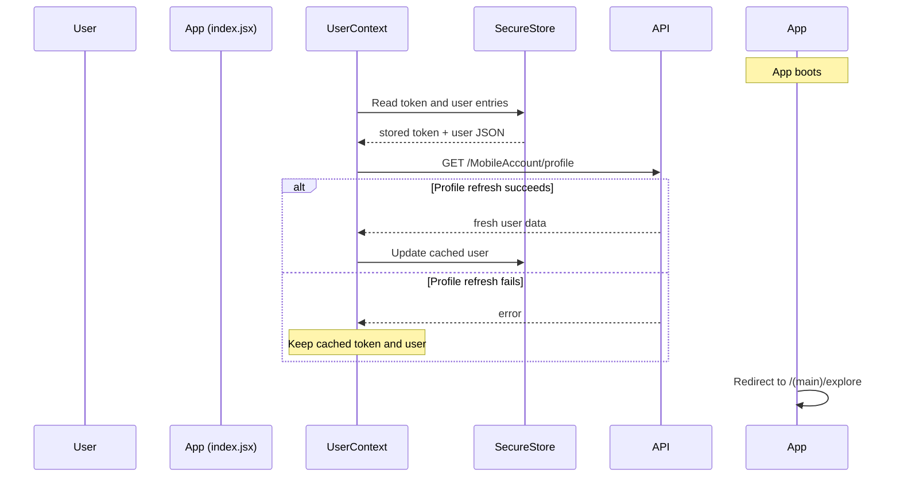
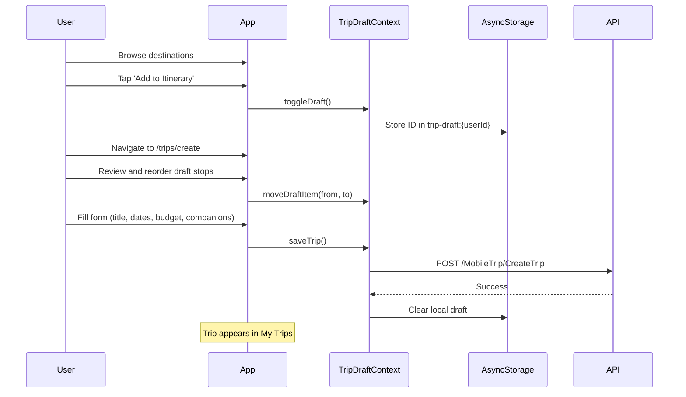
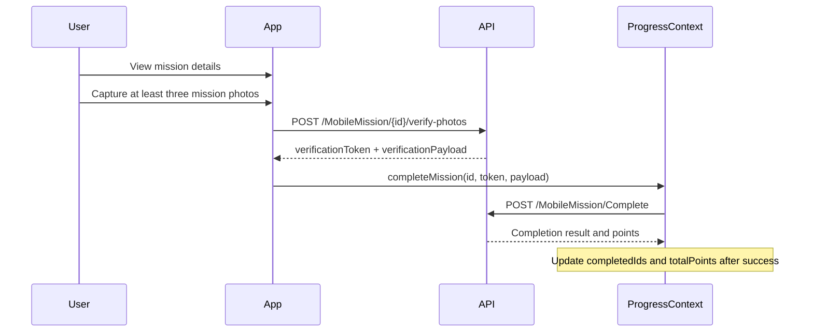
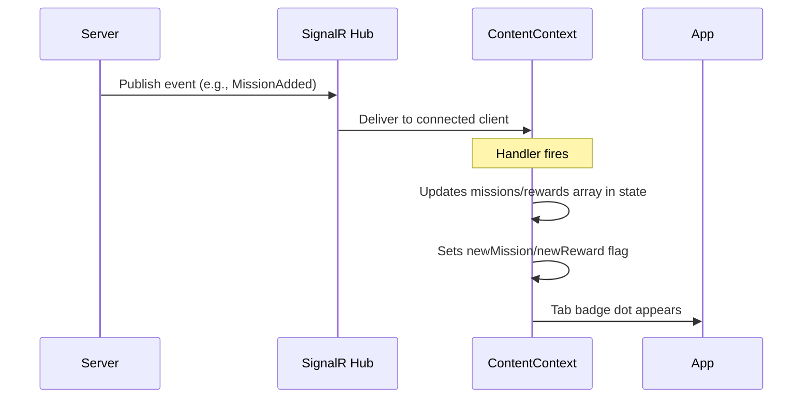

# Data Flow Architecture

This document describes the major data flows in the EGYXplore application.

## 1. Login & Session Restoration

## 2. Login Flow
- User submits form
- Calls `loginUser(credentials)`
- **POST** `/MobileAccount/Login`
- Receives `{token, user}`
- Saves to `SecureStore`
- Sets state in `UserContext`
- Redirects to main app flow

## 3. Loading Content
In `ContentContext` on mount (when token is available):
- `Promise.allSettled([getMissions, getRewards, getDestinations])`
- Each request can succeed or fail independently.
- SignalR hub connects in parallel.
- On reconnect: triggers a silent refetch.

## 4. Creating a Trip

## 5. Completing a Mission

## 6. Redeeming a Reward
- View reward details
- Check points balance versus cost
- Call `redeemReward()`
- **POST** `/MobileReward/Redeem`
- Receive voucher code + remaining points
- Update local state in `ProgressContext`

## 7. Receiving a SignalR Notification

## 8. Sending an AI Message
- User types message (optionally attaches images/audio).
- Images converted to base64.
- Audio converted to base64.
- FormData built.
- **POST** `/AiChat/Send`.
- JSON response rendered in chat.
- History and individual sessions are loaded through `/AiChat/GetHistory` and `/AiChat/GetHistorySession?id=`.
- The current screen sends at most the latest 16 previous messages as context.
- An AI-specific 401 error logs the user out; most other API modules do not provide the same centralized behavior.

## 9. Updating or Completing a Saved Trip

- The trip detail screen loads the selected trip through `/MobileTrip/GetTripById`.
- Destination edits are submitted to `/MobileTrip/UpdateTripDestinations`.
- Completing a trip calls `/MobileTrip/CompleteTrip` and can display returned XP or badge information.
- Deleting a trip calls `/MobileTrip/DeleteTrip` and removes it from local saved-trip state after success.

## Current Limitations

- API requests do not use a shared timeout, retry strategy, cancellation policy, or offline queue.
- Route guards depend on cached local authentication presence rather than proactive token validation.
- SignalR reconnect is finite; after the configured attempts are exhausted, a later foreground transition may attempt a fresh connection.
