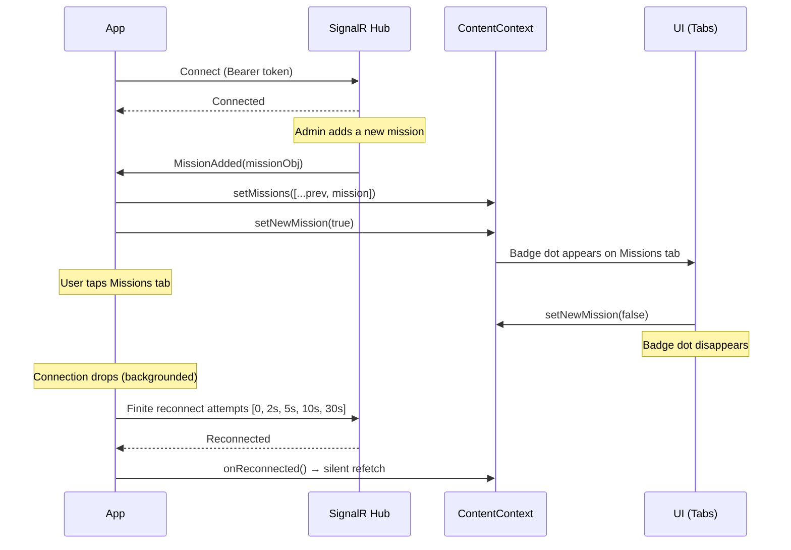

# SignalR Real-Time Integration

## Overview
The app uses Microsoft SignalR (`@microsoft/signalr` ^10.0.0) for real-time mission and reward updates. The client does not force WebSockets; SignalR negotiates an available transport. Event names and payloads documented here are the frontend's expected backend contract.

## Hub URL
```
${EXPO_PUBLIC_API_BASE}/notificationHub
```
Constructed in `api/api.js` as `HUB_BASE_URL`.

## Connection Setup (from `context/useNotificationsHub.jsx`)
Exact implementation:
```javascript
const connection = new signalR.HubConnectionBuilder()
  .withUrl(`${HUB_BASE_URL}`, {
    accessTokenFactory: () => token,
  })
  .withAutomaticReconnect([0, 2000, 5000, 10000, 30000])
  .build();
```

## Authentication
- Bearer token passed via `accessTokenFactory` callback
- The frontend supplies the same JWT used by REST requests. Hub-side validation must be confirmed in the backend configuration.
- Connection only established when `token` is available

## Automatic Reconnection Strategy
Retry delays: `[0, 2000, 5000, 10000, 30000]` milliseconds
- Immediate retry → 2 seconds → 5 seconds → 10 seconds → 30 seconds
- This is a finite sequence. Automatic reconnect stops after the configured delays are exhausted.
- On successful reconnect: `handlers.onReconnected?.()` fires, which triggers a silent data refetch in ContentContext

## App State Handling
When the app returns to foreground (AppState becomes 'active'):
- Checks if connection is `Disconnected`
- If so, attempts to restart the connection
- This handles cases where the OS ended the real-time connection while the app was backgrounded

## Subscribed Events

| Event Name | Payload | Handler Action |
|-----------|---------|----------------|
| `MissionAdded` | Mission object | Appends to missions array, sets `newMission = true` (shows badge dot) |
| `MissionUpdated` | Updated mission object | Replaces matching mission by ID in array |
| `MissionDeleted` | Mission ID expected to match stored ID type | Removes mission from array by strict ID equality |
| `RewardAdded` | Reward object | Appends to rewards array, sets `newReward = true` (shows badge dot) |
| `RewardUpdated` | Updated reward object | Replaces matching reward by ID in array |
| `RewardDeleted` | Reward ID expected to match stored ID type | Removes reward from array by strict ID equality |

## UI Updates Triggered
- `newMission` flag → blue dot badge on Missions tab icon
- `newReward` flag → blue dot badge on Rewards tab icon
- Badge dots only show if user has `allowMissionsNotifications` / `allowRewardsNotifications` enabled in Settings
- Tapping the tab clears the corresponding badge (via `listeners.tabPress`)
- These switches only control badge visibility. The SignalR connection and state updates continue regardless of the preference.
- The preferences are in memory and reset when `ContentProvider` remounts; they are not OS push-notification permissions or server subscription settings.

## Connection Lifecycle Diagram


## Cleanup
- On component unmount (or token change), the hook removes the AppState listener and stops the connection
- Event handlers are registered once per connection lifecycle

## Integration Architecture
- `useNotificationHub(token, handlers)` is called inside `ContentProvider`
- Handlers directly update ContentContext state
- This means all components consuming ContentContext automatically re-render with fresh data

## Delivery and Lifecycle Limitations

- The frontend does not validate event payload schemas or normalize identifier types.
- Delivery persistence, ordering, duplication, and replay guarantees depend on the backend and are not established by the frontend.
- If the initial connection fails, the error is logged. There is no polling fallback.
- After reconnect attempts are exhausted, returning the app to the foreground can start a new connection if its state is `Disconnected`.
- Reconnection triggers a content refetch to resynchronize client state.
- The handlers object also contains an `onReconnected` lifecycle callback; it should be kept conceptually separate from server event contracts.
